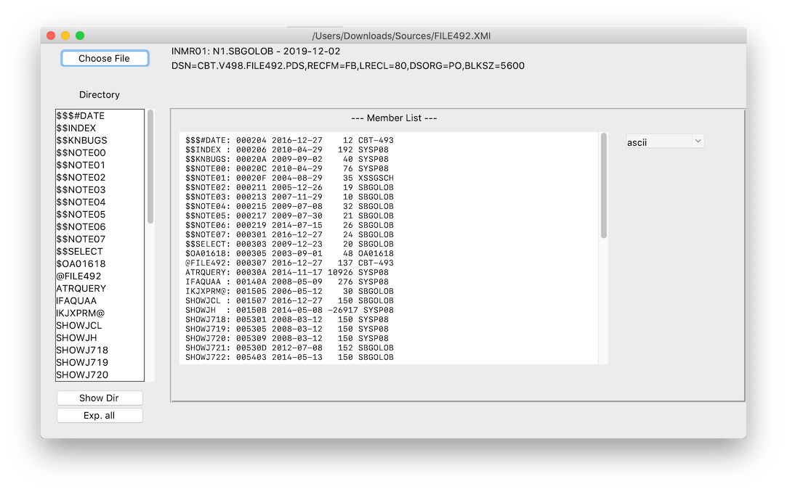
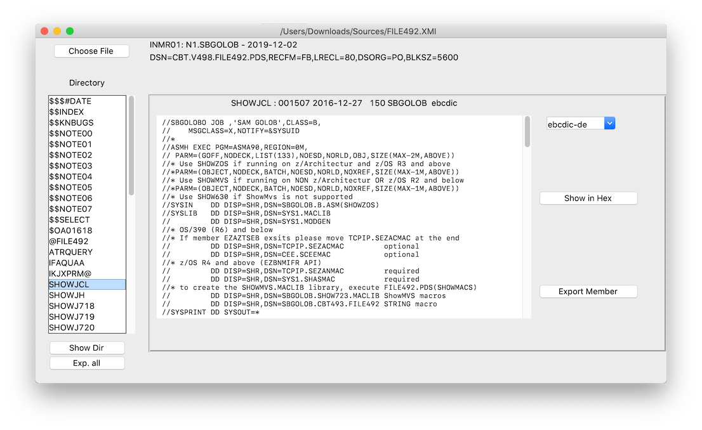

# xmitviewer
Parse, View and Extract MVS XMIT Files

## Prereqs
 1. You know what xmit file means, check [TSO Transmitting data sets](https://www.ibm.com/support/knowledgecenter/en/SSLTBW_2.3.0/com.ibm.zos.v2r3.ikjc500/ikj2l2_Transmitting_data_sets.htm).
 1. One or more xmit files, you can download a few on [ctbtape.org](http://cbttape.org/)
 1. Python3 and pip to install the xmitviewer package with
``` 
     pip install -e . 
```

## Using xmitviewer from the python shell
```python
pds = xmitviewer.Xmitfile(<pth>).get_pds()
# explore the pds
# ...
# or
pds.export_all()
```

## Using xmitviewer with ttk
You can examine the contents of xmit files with ttkgui. Run from terminal:
```
    python -c 'import xmitviewer;xmitviewer.Ttkgui().mainloop()'
```
and open nice xmit file via button _Choose File_.

Button _Exp. all_ will export all members after choosing an output directory.

Select one of the members in the directory view. xmitviewer examines member's content to determine whether it is EBCDIC text or binary data (e.g. pdf file or xmit file):

xmitviewer tries to guess a suitable code page to correctly display the content of EBCDIC text member. _Export Member_ will export the EBCDIC text to UTF-8 file.

